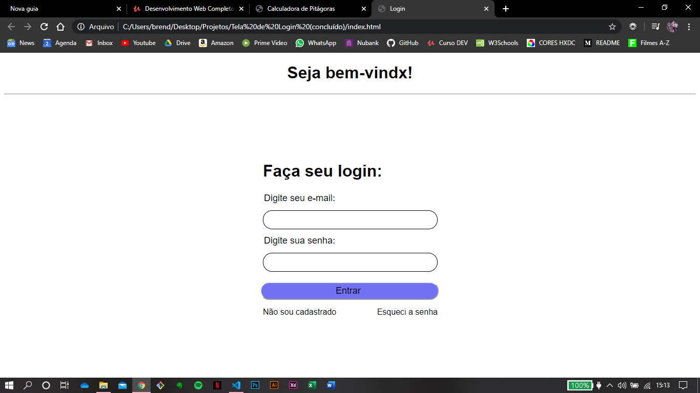

<h1 align="center">
  Interface de login
</h1>

### Este é o meu segundo projeto desenvolvido com o objetivo de colocar em prática os conhecimentos obtidos durante o aprendizado de Desenvolvimento Web. E através dos repositórios está sendo possível acompanhar uma timeline da minha evolução.
________
 
### 📚 Tecnologias utilizadas:
* CSS
* HTML

### ✨ Sobre o projeto e o que eu aprendi:
Este projeto é uma tela de login com mensagem de boas vindas, e-mail, senha, não sou cadastrado e esqueci a senha.

 *Para este projeto eu aprendi como utilizar elementos flutuantes, posicionamento estático, relativo, absoluto e fixo e sobreposição de elementos.*

### 📷 Screenshot do site:

________

<h4 align="center">
  Feito com ❤ by Brenda Miranda
</h4>
